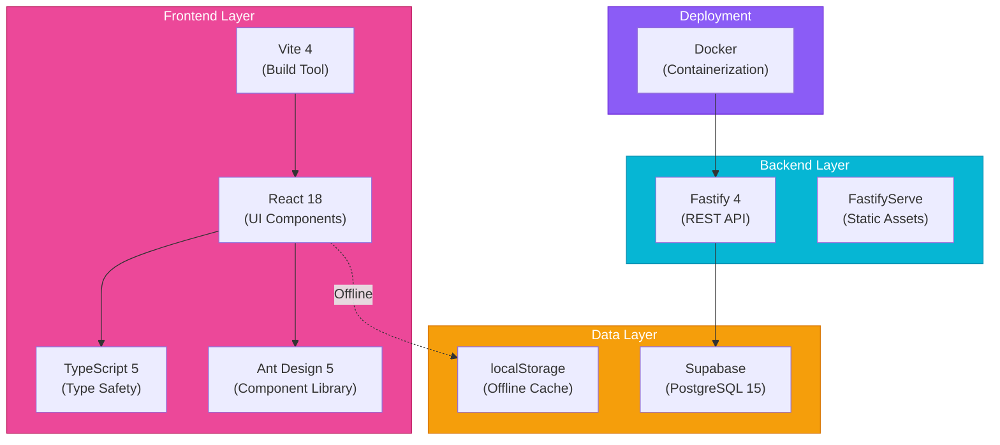
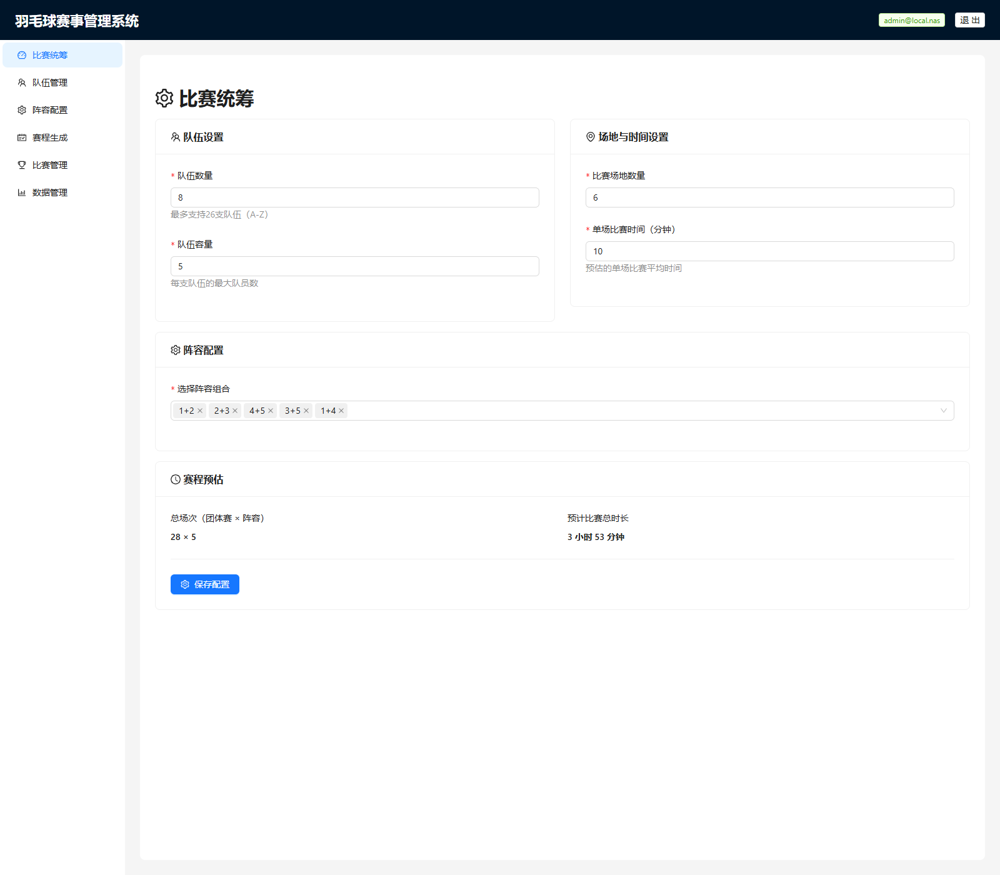
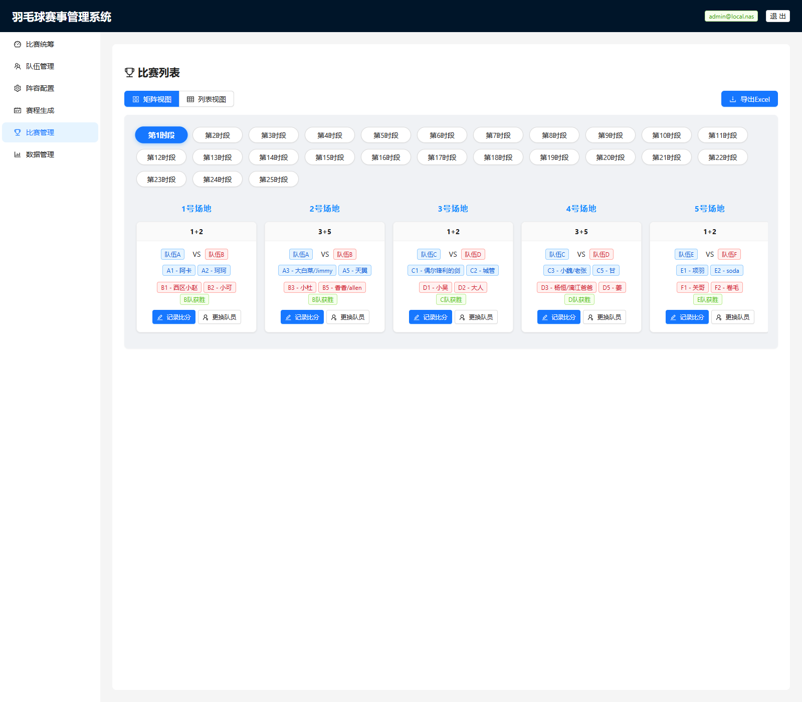

<div align="center">

# Badminton Tournament Tool


**[English](README.md) | [中文](README_CN.md)**

[](https://github.com/hakupao)[](https://react.dev/) [](https://www.typescriptlang.org/)
[](https://vitejs.dev/)
[](https://www.fastify.io/)
[](https://www.postgresql.org/)
[](https://www.docker.com/)
[](LICENSE)

</div>

---

## 📋 Overview

Badminton Tournament Tool is a comprehensive team badminton competition management solution. As the predecessor to ShuttleArena, it provides robust features for organizing team-based tournaments with full roster configuration, intelligent scheduling, real-time scoring, and detailed analytics.

---

## ✨ Key Features

<table>
<tr>
<td>👥</td>
<td><strong>Team Setup & Roster Configuration</strong><br/>Comprehensive player management with team hierarchies and roles</td>
</tr>
<tr>
<td>📋</td>
<td><strong>Flexible Roster Management</strong><br/>Add, edit, and organize team rosters with multiple squad configurations</td>
</tr>
<tr>
<td>📅</td>
<td><strong>Smart Schedule Generation</strong><br/>Automated round-robin and bracket scheduling with conflict detection</td>
</tr>
<tr>
<td>⚡</td>
<td><strong>Real-Time Scoring</strong><br/>Live match tracking and instant result updates</td>
</tr>
<tr>
<td>📊</td>
<td><strong>Comprehensive Statistics</strong><br/>Player performance metrics, team rankings, and detailed analytics</td>
</tr>
<tr>
<td>📥</td>
<td><strong>Excel Export</strong><br/>Generate schedules and reports in Excel format</td>
</tr>
<tr>
<td>📱</td>
<td><strong>Offline Mode</strong><br/>localStorage fallback for uninterrupted experience without internet</td>
</tr>
</table>

---

## 🏗️ Architecture



---

## 🚀 Tech Stack

| Component | Technology | Version |
|-----------|-----------|---------|
| **Frontend Framework** | React | 18.0 |
| **Language** | TypeScript | 5.0 |
| **Build Tool** | Vite | 4.0 |
| **Component Library** | Ant Design | 5.0 |
| **Backend Framework** | Fastify | 4.0 |
| **Database** | PostgreSQL | 15 |
| **Cloud Platform** | Supabase | Latest |
| **Containerization** | Docker | Latest |

---

## 📸 Screenshots

<details>
<summary><strong>🏠 Dashboard & Home</strong></summary>

Central dashboard for managing teams, tournaments, and upcoming matches.


</details>

<details>
<summary><strong>👥 Team Management</strong></summary>

Intuitive interface for team setup and roster configuration.


</details>

<details>
<summary><strong>📋 Roster Configuration</strong></summary>

Comprehensive player list management with role assignment and squad organization.


</details>

<details>
<summary><strong>📅 Schedule Generation</strong></summary>

Visual schedule matrix showing all matches with automatic conflict detection.


</details>

<details>
<summary><strong>⚡ Live Scoring</strong></summary>

Real-time score entry and match management interface.


</details>

<details>
<summary><strong>📊 Statistics & Rankings</strong></summary>

Comprehensive player and team performance analytics with rankings.


</details>

---


<details>
<summary><strong>⚙️ Tournament Setup</strong></summary>

Configure tournament parameters, team settings, and match rules.



</details>

<details>
<summary><strong>📊 Match Matrix</strong></summary>

Visual match matrix showing all pairings, scores, and real-time status.



</details>

## 🚀 Getting Started

### Prerequisites
- Node.js 18+
- Docker (for containerized deployment)
- Supabase account (for database)
- pnpm or npm

### Installation

```bash
# Clone the repository
git clone https://github.com/hakupao/badminton_tournament_tool.git
cd badminton_tournament_tool

# Install dependencies
pnpm install

# Configure environment variables
cp .env.example .env.local

# Start development server
pnpm dev
```

The application will be available at [http://localhost:5173](http://localhost:5173)

### Docker Deployment

```bash
# Build Docker image
docker build -t badminton-tournament-tool .

# Run container
docker run -p 3000:3000 \
  -e DATABASE_URL=your_database_url \
  badminton-tournament-tool
```

---

## 📖 Usage Guide

<details>
<summary><strong>🏢 Setting Up a Team</strong></summary>

1. Navigate to **Teams** → **Create New Team**
2. Enter team name and basic information
3. Add team members with roles (player, coach, manager)
4. Configure squad preferences
5. Save team settings

</details>

<details>
<summary><strong>👥 Managing Team Rosters</strong></summary>

1. Go to **Team** → **Roster Management**
2. Add players to the roster
3. Assign positions and roles
4. Create multiple squad configurations if needed
5. Activate your preferred squad for tournaments

</details>

<details>
<summary><strong>📅 Generating Tournament Schedule</strong></summary>

1. Select **Tournaments** → **New Tournament**
2. Choose tournament format (round-robin, bracket, etc.)
3. Add participating teams
4. Configure schedule parameters
5. Click **Generate Schedule**
6. Review and adjust if necessary
7. Export to Excel if needed

</details>

<details>
<summary><strong>⚡ Recording Match Results</strong></summary>

1. Open the match from the schedule
2. Enter scores for each set
3. Update player statistics
4. Mark match as completed
5. Changes sync automatically (or save to offline cache)

</details>

<details>
<summary><strong>📊 Analyzing Performance Data</strong></summary>

1. Navigate to **Statistics** section
2. Select player or team to analyze
3. View performance trends and metrics
4. Export reports in Excel format
5. Compare team or player statistics

</details>

---

## 🔌 Backend API

The Fastify backend provides RESTful API endpoints:

```bash
# Core Endpoints
GET    /api/teams              # List all teams
POST   /api/teams              # Create team
GET    /api/teams/:id          # Get team details
PUT    /api/teams/:id          # Update team

GET    /api/tournaments        # List tournaments
POST   /api/tournaments        # Create tournament
GET    /api/tournaments/:id    # Get tournament details

GET    /api/matches            # List matches
POST   /api/matches/:id/score  # Record match score

GET    /api/statistics         # Get aggregated statistics
```

---

## 💾 Offline Support

The application gracefully handles offline scenarios:

- All data is cached in browser's localStorage
- Changes made offline are queued for sync
- When connection is restored, data automatically syncs
- Seamless user experience without interruption

```javascript
// Example offline usage
const offlineData = {
  teams: [],
  tournaments: [],
  matches: [],
  lastSyncTime: null
};

// Automatic sync when online
window.addEventListener('online', () => {
  syncOfflineChanges();
});
```

---

## 🔄 CI/CD

The project includes automated workflows:

```yaml
# GitHub Actions
- Lint & format checks
- TypeScript compilation
- Unit tests
- Docker image build
- Deployment to registry
```

---

## 🛠️ Development

### Project Structure

```
badminton_tournament_tool/
├── src/
│   ├── components/       # React components
│   ├── pages/           # Page layouts
│   ├── services/        # API & business logic
│   ├── hooks/           # Custom React hooks
│   ├── types/           # TypeScript definitions
│   └── styles/          # CSS & Tailwind
├── server/
│   ├── routes/          # API routes
│   ├── controllers/      # Request handlers
│   ├── db/              # Database queries
│   └── middleware/       # Express middleware
├── public/              # Static assets
├── docs/               # Documentation
├── Dockerfile          # Container configuration
└── package.json
```

### Available Scripts

```bash
pnpm dev              # Start dev server (frontend + backend)
pnpm build            # Production build
pnpm preview          # Preview production build
pnpm test             # Run tests
pnpm lint             # ESLint
pnpm type-check       # TypeScript type checking
pnpm docker:build     # Build Docker image
```

---

## 🗄️ Database Schema

Key tables in PostgreSQL:

- `teams` - Team information
- `players` - Player profiles
- `rosters` - Squad configurations
- `tournaments` - Tournament data
- `matches` - Match records
- `match_results` - Detailed match results
- `player_statistics` - Aggregated performance data

---

## 🔒 Security

- Input validation and sanitization
- SQL parameterized queries via ORM
- CORS configuration for safe cross-origin requests
- JWT-based authentication ready
- Secure data handling in localStorage

---

## 📄 License

This project is licensed under the MIT License - see the [LICENSE](LICENSE) file for details.

---

## 🤝 Contributing

Contributions are welcome! Please follow the standard GitHub workflow:

1. Fork the repository
2. Create a feature branch
3. Make your changes
4. Submit a pull request

---

## 📞 Support

For questions, issues, or feature requests, please open an [issue](https://github.com/hakupao/badminton_tournament_tool/issues) on GitHub.

---

<div align="center">

**Made with ❤️ by [hakupao](https://github.com/hakupao)**

[⬆ back to top](#badminton-tournament-tool)

</div>
