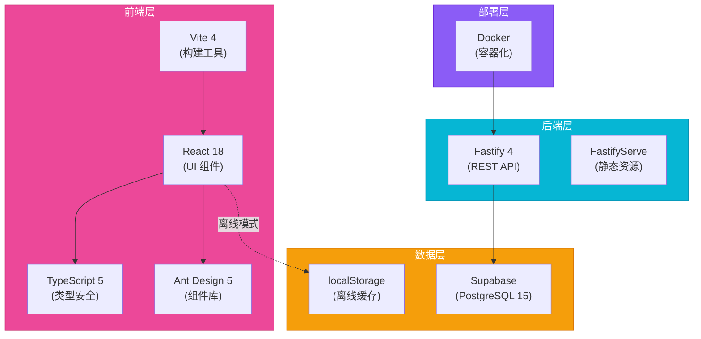

<div align="center">

# 羽毛球赛事工具


**[English](README.md) | [中文](README_CN.md)**

[](https://github.com/hakupao)
[](https://react.dev/)
[](https://www.typescriptlang.org/)
[](https://vitejs.dev/)
[](https://www.fastify.io/)
[](https://www.postgresql.org/)
[](https://www.docker.com/)
[](LICENSE)

</div>

---

## 📋 项目介绍

羽毛球赛事工具是一个功能完整的团队羽毛球赛事管理解决方案。作为 ShuttleArena 的前身，提供团队赛事组织的全面支持，包括完整的阵容配置、智能日程安排、实时计分和详细的数据分析。

---

## ✨ 核心功能

<table>
<tr>
<td>👥</td>
<td><strong>团队设置 & 阵容管理</strong><br/>完整的球员管理及团队级别配置</td>
</tr>
<tr>
<td>📋</td>
<td><strong>灵活的阵容配置</strong><br/>支持多种阵容配置方案，轻松管理球队</td>
</tr>
<tr>
<td>📅</td>
<td><strong>智能日程生成</strong><br/>自动循环赛及分组赛日程，冲突检测</td>
</tr>
<tr>
<td>⚡</td>
<td><strong>实时计分系统</strong><br/>即时比赛追踪和结果更新</td>
</tr>
<tr>
<td>📊</td>
<td><strong>全面的统计分析</strong><br/>球员表现指标、团队排名、详细数据</td>
</tr>
<tr>
<td>📥</td>
<td><strong>Excel 导出功能</strong><br/>生成 Excel 格式的日程和报表</td>
</tr>
<tr>
<td>📱</td>
<td><strong>离线模式</strong><br/>localStorage 缓存支持，无网络也能使用</td>
</tr>
</table>

---

## 🏗️ 架构设计



---


<details>
<summary><strong>⚙️ 赛事设置</strong></summary>

配置比赛参数、队伍设置和比赛规则。


</details>

<details>
<summary><strong>📊 对阵矩阵</strong></summary>

可视化对阵矩阵，显示所有配对、比分和实时状态。


</details>

## 🚀 技术栈

| 组件 | 技术 | 版本 |
|------|------|------|
| **前端框架** | React | 18.0 |
| **编程语言** | TypeScript | 5.0 |
| **构建工具** | Vite | 4.0 |
| **组件库** | Ant Design | 5.0 |
| **后端框架** | Fastify | 4.0 |
| **数据库** | PostgreSQL | 15 |
| **云服务** | Supabase | 最新 |
| **容器化** | Docker | 最新 |

---

## 📸 功能截图

<details>
<summary><strong>🏠 仪表板 & 首页</strong></summary>

用于管理团队、赛事和即将进行的比赛的中央仪表板。


</details>

<details>
<summary><strong>👥 团队管理</strong></summary>

直观的团队设置和阵容配置界面。


</details>

<details>
<summary><strong>📋 阵容配置</strong></summary>

完整的球员列表管理，支持角色分配和阵容组织。


</details>

<details>
<summary><strong>📅 日程生成</strong></summary>

可视化日程矩阵，展示所有比赛并自动检测冲突。


</details>

<details>
<summary><strong>⚡ 实时计分</strong></summary>

实时比分输入和比赛管理界面。


</details>

<details>
<summary><strong>📊 统计 & 排名</strong></summary>

全面的球员和团队表现分析及排名。


</details>

---

## 🚀 快速开始

### 系统要求
- Node.js 18+
- Docker（用于容器化部署）
- Supabase 账号（用于数据库）
- pnpm 或 npm

### 安装步骤

```bash
# 克隆仓库
git clone https://github.com/hakupao/badminton_tournament_tool.git
cd badminton_tournament_tool

# 安装依赖
pnpm install

# 配置环境变量
cp .env.example .env.local

# 启动开发服务器
pnpm dev
```

应用将在 [http://localhost:5173](http://localhost:5173) 上运行

### Docker 部署

```bash
# 构建 Docker 镜像
docker build -t badminton-tournament-tool .

# 运行容器
docker run -p 3000:3000 \
  -e DATABASE_URL=your_database_url \
  badminton-tournament-tool
```

---

## 📖 使用指南

<details>
<summary><strong>🏢 建立球队</strong></summary>

1. 进入 **团队** → **创建新团队**
2. 输入团队名称和基本信息
3. 添加团队成员并分配角色（球员、教练、管理）
4. 配置阵容首选项
5. 保存团队设置

</details>

<details>
<summary><strong>👥 管理球队阵容</strong></summary>

1. 打开 **团队** → **阵容管理**
2. 添加球员到阵容
3. 分配位置和角色
4. 如需要，创建多个阵容方案
5. 激活赛事时首选的阵容

</details>

<details>
<summary><strong>📅 生成赛事日程</strong></summary>

1. 选择 **赛事** → **新建赛事**
2. 选择赛事格式（循环赛、分组赛等）
3. 添加参赛团队
4. 配置日程参数
5. 点击 **生成日程**
6. 检查并根据需要调整
7. 如需要，导出为 Excel

</details>

<details>
<summary><strong>⚡ 录入比赛成绩</strong></summary>

1. 从日程中打开比赛
2. 输入各局比分
3. 更新球员统计信息
4. 标记比赛已完成
5. 自动同步（或保存到离线缓存）

</details>

<details>
<summary><strong>📊 分析性能数据</strong></summary>

1. 进入 **统计** 部分
2. 选择要分析的球员或团队
3. 查看性能趋势和指标
4. 导出 Excel 格式的报告
5. 比较球员或团队的数据

</details>

---

## 🔌 后端 API

Fastify 后端提供 RESTful API 接口：

```bash
# 核心接口
GET    /api/teams              # 获取所有团队
POST   /api/teams              # 创建团队
GET    /api/teams/:id          # 获取团队详情
PUT    /api/teams/:id          # 更新团队

GET    /api/tournaments        # 获取所有赛事
POST   /api/tournaments        # 创建赛事
GET    /api/tournaments/:id    # 获取赛事详情

GET    /api/matches            # 获取所有比赛
POST   /api/matches/:id/score  # 录入比赛成绩

GET    /api/statistics         # 获取统计数据
```

---

## 💾 离线模式支持

应用可以优雅地处理离线场景：

- 所有数据缓存在浏览器的 localStorage
- 离线时的更改会排队等待同步
- 连接恢复后，数据自动同步
- 无需网络也能无缝使用

```javascript
// 离线使用示例
const offlineData = {
  teams: [],
  tournaments: [],
  matches: [],
  lastSyncTime: null
};

// 恢复连接时自动同步
window.addEventListener('online', () => {
  syncOfflineChanges();
});
```

---

## 🔄 CI/CD 工作流

项目包含自动化工作流：

```yaml
# GitHub Actions
- Lint & 格式检查
- TypeScript 编译
- 单元测试
- Docker 镜像构建
- 部署到镜像仓库
```

---

## 🛠️ 开发相关

### 项目结构

```
badminton_tournament_tool/
├── src/
│   ├── components/       # React 组件
│   ├── pages/           # 页面布局
│   ├── services/        # API & 业务逻辑
│   ├── hooks/           # 自定义 React hooks
│   ├── types/           # TypeScript 类型定义
│   └── styles/          # CSS & Tailwind
├── server/
│   ├── routes/          # API 路由
│   ├── controllers/      # 请求处理器
│   ├── db/              # 数据库查询
│   └── middleware/       # Express 中间件
├── public/              # 静态资源
├── docs/               # 文档
├── Dockerfile          # 容器配置
└── package.json
```

### 常用命令

```bash
pnpm dev              # 启动开发服务器（前端+后端）
pnpm build            # 生产环境构建
pnpm preview          # 预览生产构建
pnpm test             # 运行测试
pnpm lint             # ESLint 检查
pnpm type-check       # TypeScript 类型检查
pnpm docker:build     # 构建 Docker 镜像
```

---

## 🗄️ 数据库架构

PostgreSQL 中的关键表：

- `teams` - 团队信息
- `players` - 球员信息
- `rosters` - 阵容配置
- `tournaments` - 赛事数据
- `matches` - 比赛记录
- `match_results` - 详细比赛结果
- `player_statistics` - 聚合的表现数据

---

## 🔒 安全性

- 输入验证和清理
- 通过 ORM 的 SQL 参数化查询
- 安全的跨域请求 CORS 配置
- JWT 身份验证就绪
- localStorage 安全的数据处理

---

## 📄 许可证

此项目采用 MIT 许可证 - 详见 [LICENSE](LICENSE) 文件。

---

## 🤝 贡献指南

欢迎贡献！请遵循标准的 GitHub 工作流：

1. Fork 该仓库
2. 创建特性分支
3. 进行更改
4. 提交 Pull Request

---

## 📞 获取帮助

如有问题、疑问或功能请求，请在 GitHub 上提交 [issue](https://github.com/hakupao/badminton_tournament_tool/issues)。

---

<div align="center">

**用❤️ 打造，作者：[hakupao](https://github.com/hakupao)**

[⬆ 回到顶部](#羽毛球赛事工具)

</div>
